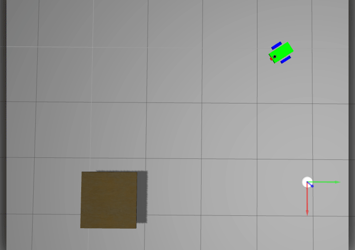

# Go Chase it
## chaser-ball-robot

A differential drive robot that pursues a white ball in a gazebo environment. This robot uses a front camera to detect where the ball is and determine forward velocity in x direction and angular velocity along z axis. 
Here you will find two ROS packages to accomplish:

1. **my_robot**

    It contains a world and a mobile robot definition. It has the following folder structure:

    `launch` : with the gazebo world main launcher.

    `meshes` : mesh for the hokuyo lidar.
    
    `urdf`   : files with gazebo plugins for: a differential drive controller, lidar and camera sensors.

    `worlds` : gazebo world with mobile robot, building and white ball to pursue.

2. **ball_chaser**

    Package that has two nodes: `drive_bot` and `process_image` to accomplish the pursuing of the white ball. It has the following folder structure:

    `launch` : with the launcher of two nodes.

    `src`    : contains the souce file of two nodes.

    `srv`    : file definition for the service request and response to send a command to the robot.
  
# Demo

Launch in a terminal, after build and source the environment variables:
    `roslaunch my_robot world.launch`

Open a new terminal, source the environment variables and type:
    `roslaunch ball_chaser ball_chaser.launch`

 
